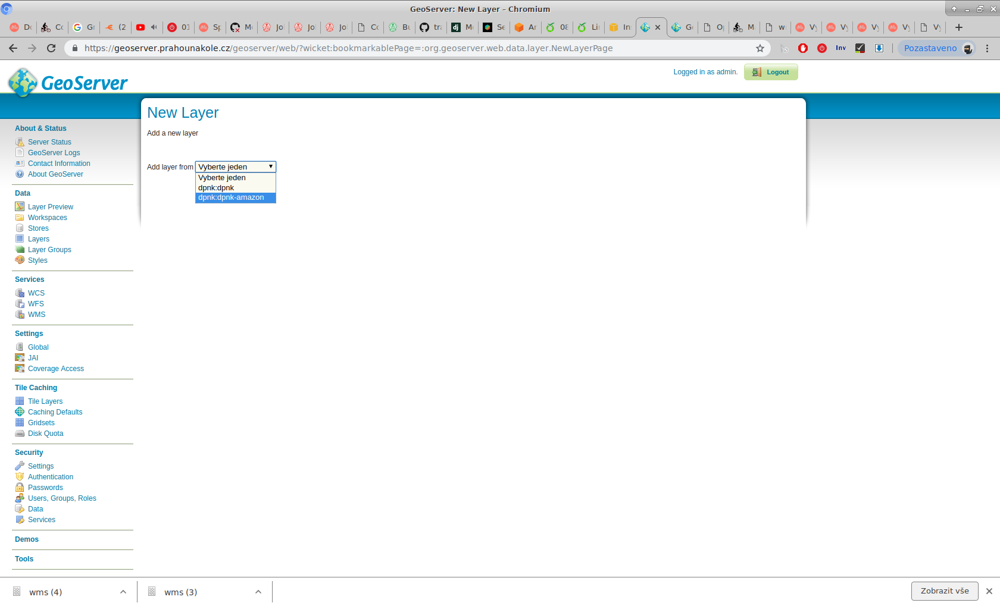
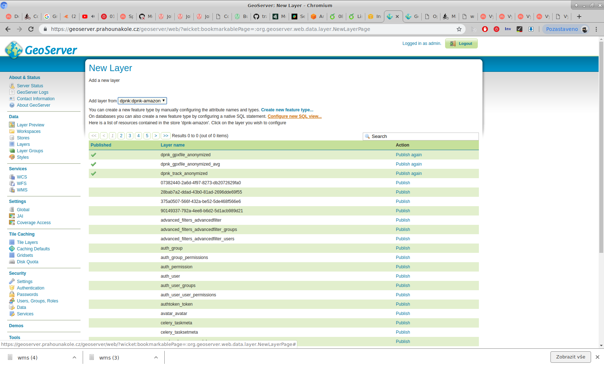
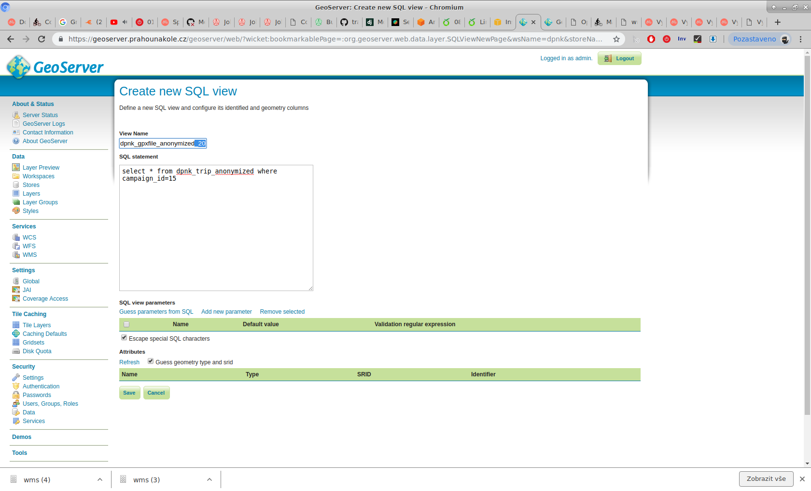
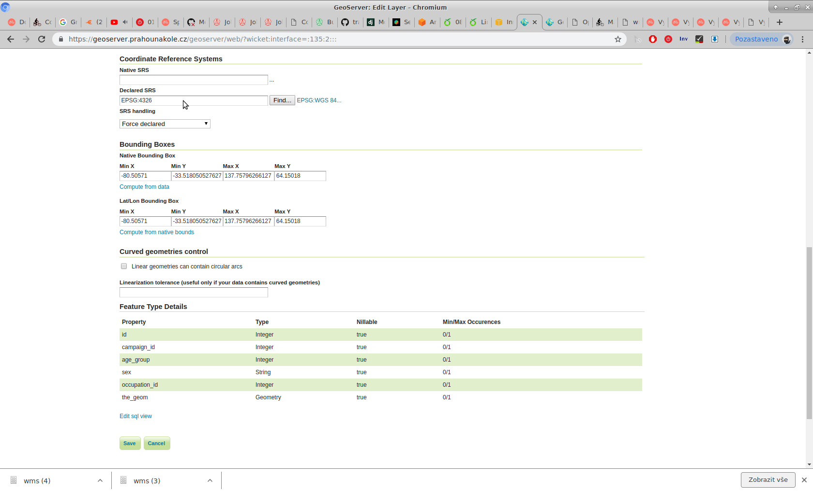
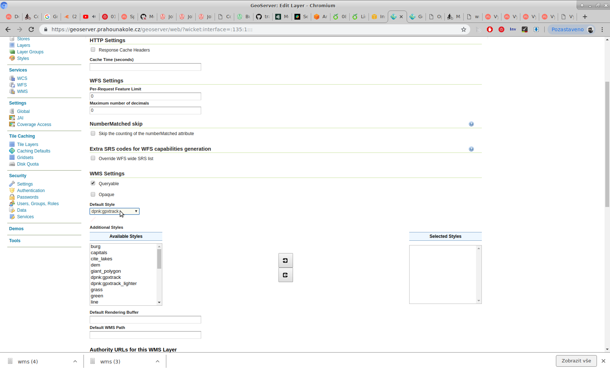
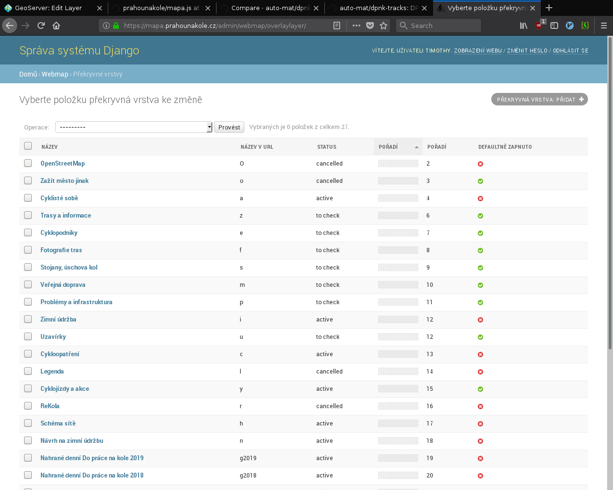
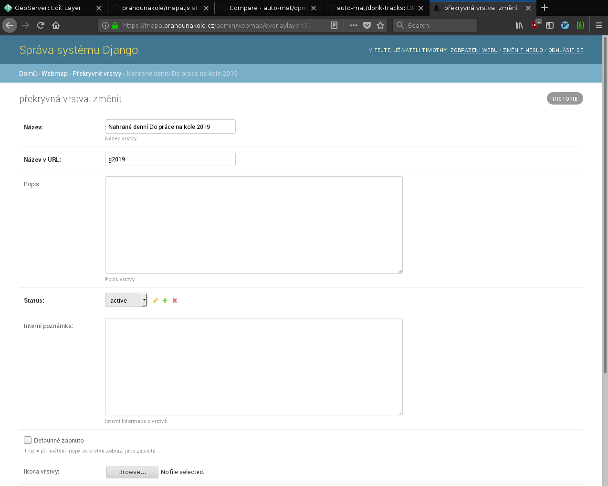
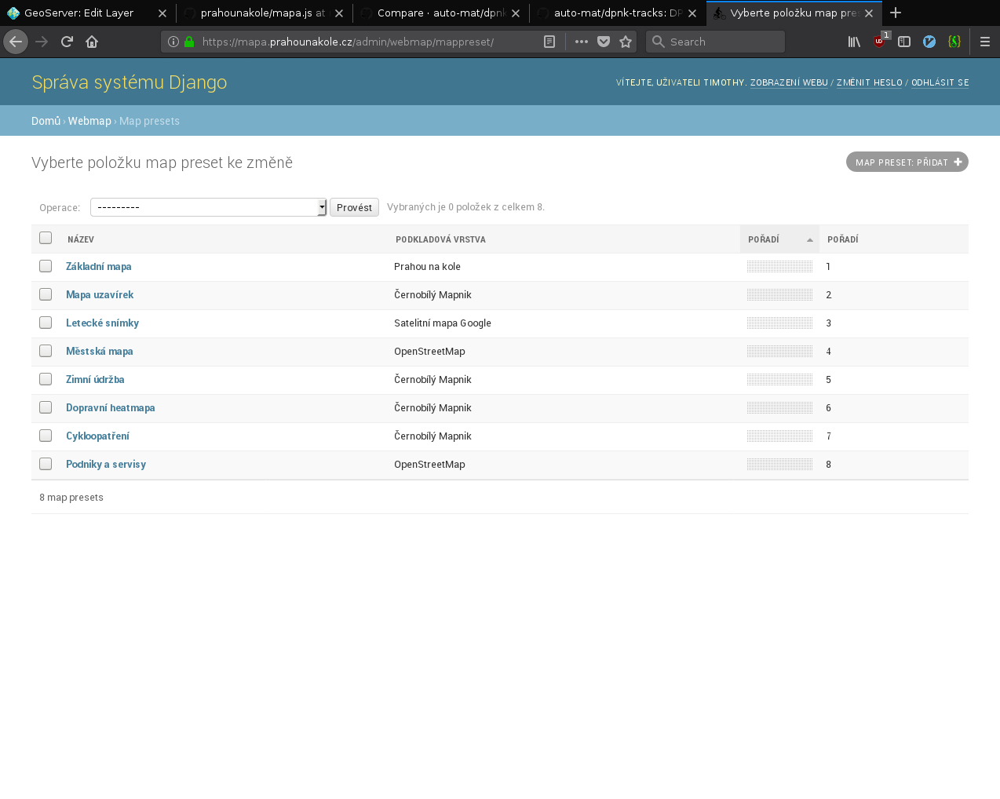

Skript na vytvoení anonimizovaných tras z DPNK

1. Run the script ./sync-hosts found in the do-prace-na-kole/scripts directory
2. Run the script ./generate_gis_export <ip-of-celery-instance> also in the scripts directory. This will take a *long* time.
3. Now go to the [geoserver web interface](https://geoserver.prahounakole.cz/geoserver/web/)
4. Now select dpnk:dpnk-amazon

5. Click the "Configure new SQL view..." link

6. Configure the name for your new layer and set sql command making sure you have the right campaing_id. You should also check the "Guess geometry type and srid" checkbox.

7. On the "Data" tab you need to select "EPSG:4326" as the SRS and click the "Compute from Data" links for the bounds.

8. Finally, on the "Publishing" tab select "dpnk:gpxtrack" as the default style.

9. Update [the code](https://github.com/auto-mat/prahounakole/blob/master/apps/cyklomapa/static/js/mapa.js) to include the new layer and publish the changes to the server.
10. Go to https://mapa.prahounakole.cz/admin/ and add a new "Překryvné vrstva"

11. Set the "Název v URL" to the slug configured in the javascript and uncheck "Defantě zapnuto"

12. Go to "Map presets" and select "Dopravní heatmapa"

13. Add the new "překryvná vrstva"
