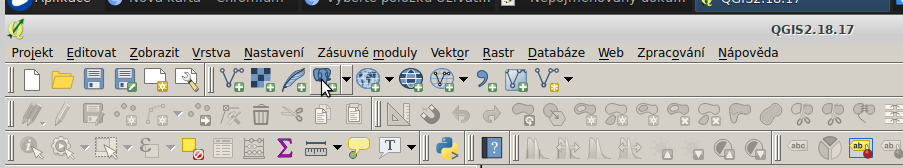
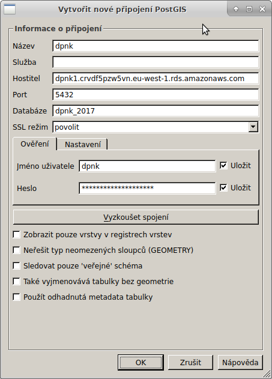
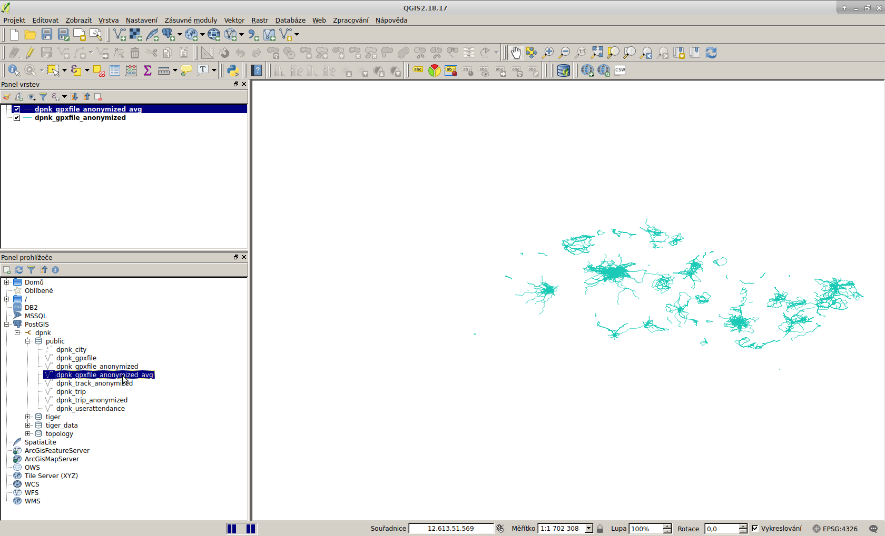
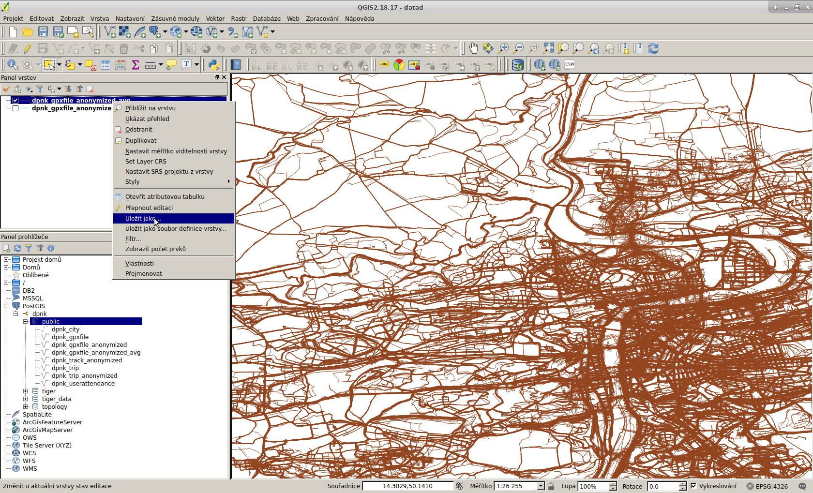
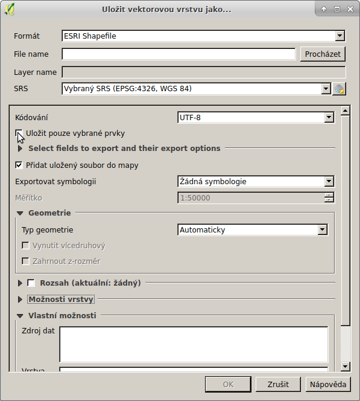

1. `apt install qgis`
1. nastavit security groups v AWS abych měl přístup z lokálního počítače

1. nastavit PSQL připojení

1. stáhnout vhodnou vrstvu (pravděpodobně `dpnk_gpxfile_anonymized_avg`)

1. vybrat oblast dat (nebo všechna)
1. uložit vrstvu jako `ESRI Shapefile` (případně jiný formát)

1. pokud chceme uložit jen výběr, tak to zaškrtnout

