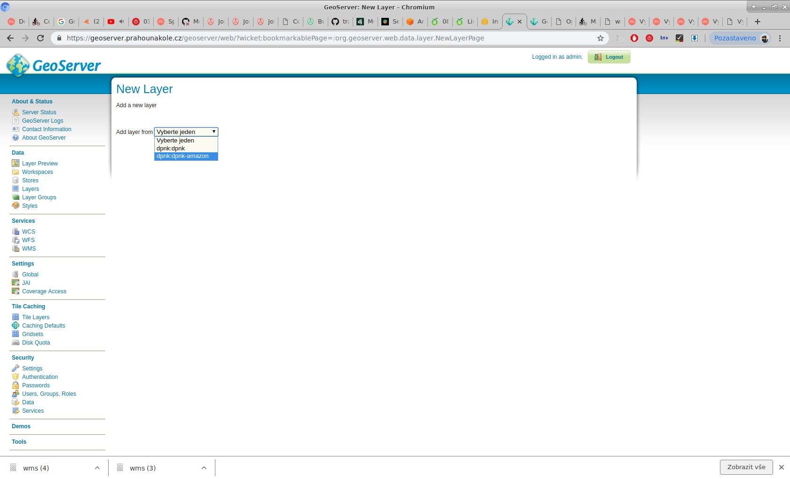
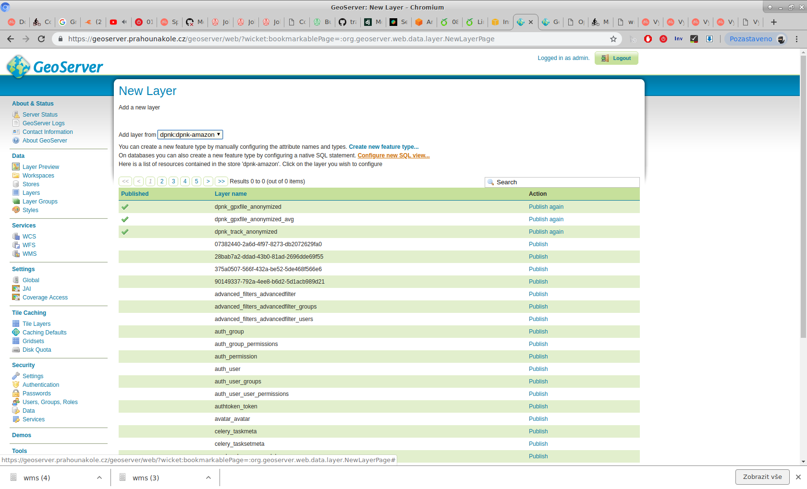
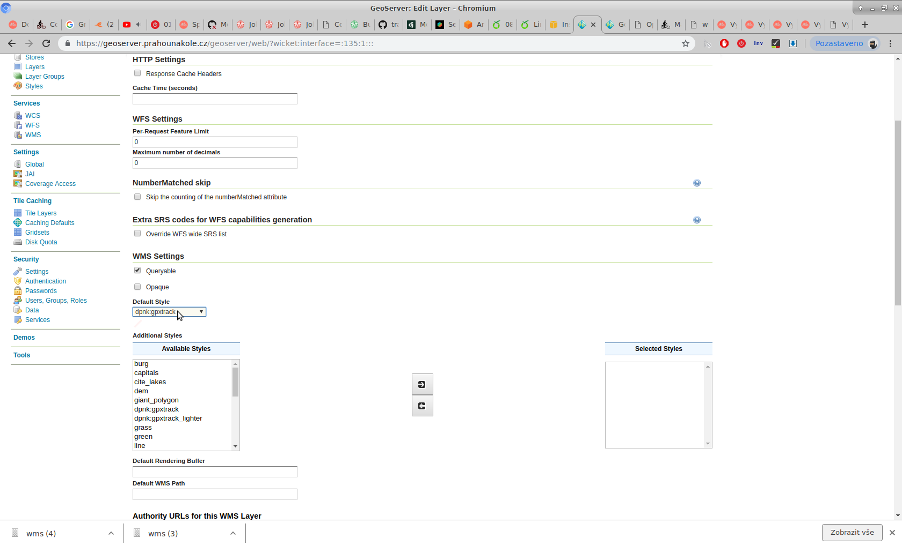
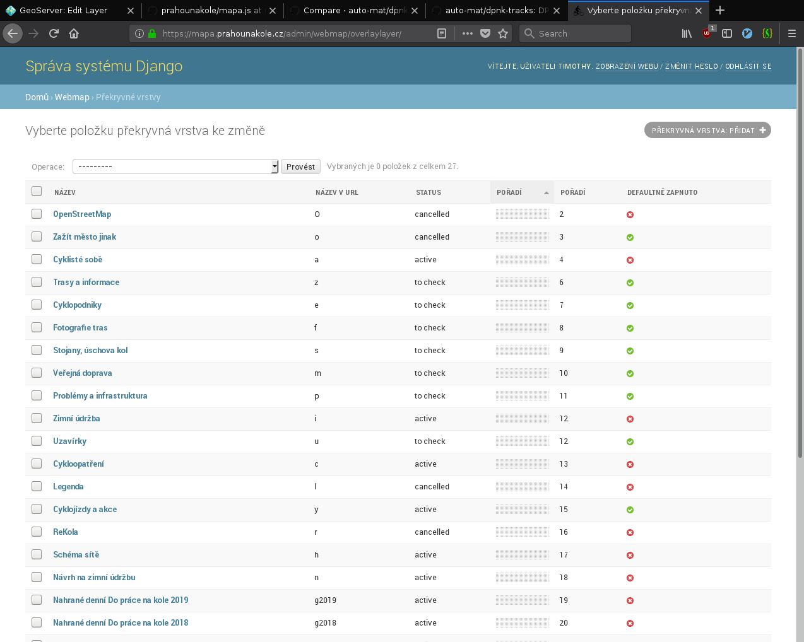
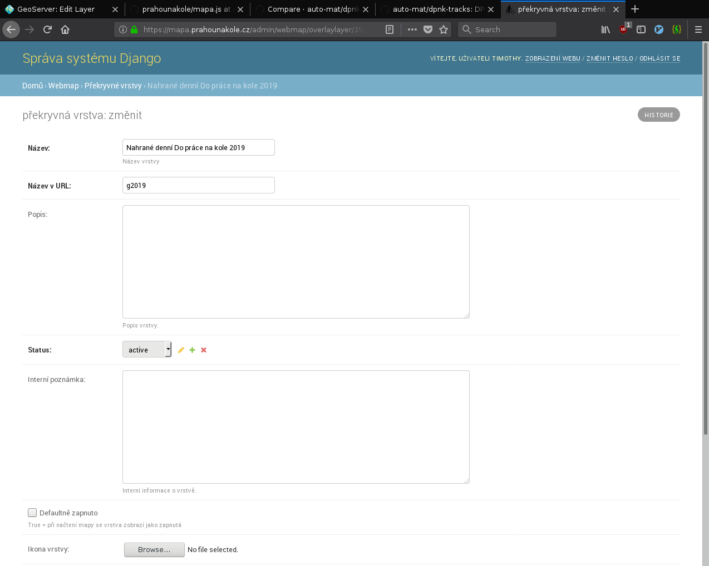

Skript na vytvoení anonimizovaných tras z DPNK

1. In the [DPNK city in campaign admin](https://dpnk.dopracenakole.cz/admin/dpnk/cityincampaign/) run the admin action "Vygenerovat tabulka anonymních jízd a vytvořit .shp soubor pro export GIS data".
2. Now go to the [geoserver web interface](https://geoserver.prahounakole.cz/geoserver/web/)
3. Now select dpnk:dpnk-amazon

4. Click the "Configure new SQL view..." link

5. Configure the name for your new layer and set sql command making sure you have the right campaing_id. You should also check the "Guess geometry type and srid" checkbox.

6. On the "Data" tab you need to select "EPSG:4326" as the SRS and click the "Compute from Data" links for the bounds.

7. Finally, on the "Publishing" tab select "dpnk:gpxtrack" as the default style.

8. Update [the code](https://github.com/auto-mat/prahounakole/blob/master/apps/cyklomapa/static/js/mapa.js) to include the new layer and publish the changes to the server.
9. Go to https://mapa.prahounakole.cz/admin/ and add a new "Překryvné vrstva"

10. Set the "Název v URL" to the slug configured in the javascript and uncheck "Defantě zapnuto"

11. Go to "Map presets" and select "Dopravní heatmapa"

12. Add the new "překryvná vrstva"
