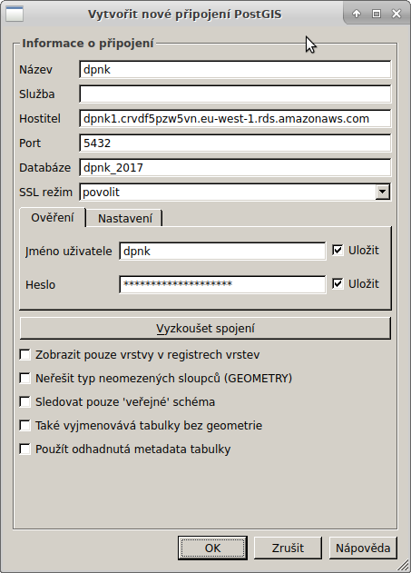

1. `apt install qgis`
1. nastavit security groups v AWS abych měl přístup z lokálního počítače

1. nastavit PSQL připojení (it is necessary to add your IP address to the RDS security group in the AWS console. This security group is linked from the about information in the RDS db admin).

1. stáhnout vrstvu `dpnk_trip_anonymized`

1. Klikní na tlačitko 'Select features using an expression'
1. Zadavej expression v tvaru `"city" = 'olomouc'`
1. uložit vrstvu jako `ESRI Shapefile` (případně jiný formát)

1. pokud chceme uložit jen výběr, tak to zaškrtnout

